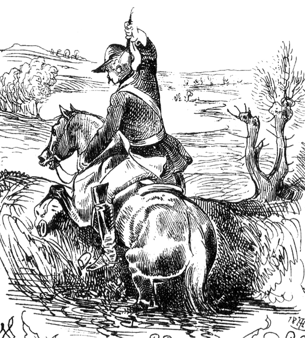

# Munchausen

From [wikipedia](https://en.wikipedia.org/wiki/Baron_Munchausen):

```
In his 1886 philosophical treatise Beyond Good and Evil,
Friedrich Nietzsche uses one of the Baron's adventures,
the one in which he rescues himself from a swamp,
as a metaphor for belief in complete metaphysical free will;
Nietzsche calls this belief an attempt
"to pull oneself up into existence by the hair, out of the swamps of nothingness"
```



# Problem
We do have a similar need, i.e. we need a way to finalize Jenkins pipeline by killing existing Jenkins process and starting a new container from the freshly build image. Problem is that stop of Jenkins process will terminate pipeline execution, i.e. we can stop current instance but there will be no one to kick off a new one.

# Solution

That's why we do a trick inspired by Baron Munchausen. We have a possibility to start a sibling containers from the slave container by sending	 docker commands   through the mounted Docker socket to the docker engine running on the host. In this way, we can ask Docker engine to kick off a new container that will kill master and boot up a new one. Since this is a sibling container not connected to the Jenkins process it will not be affected by the master termination.
